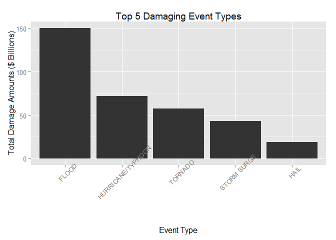
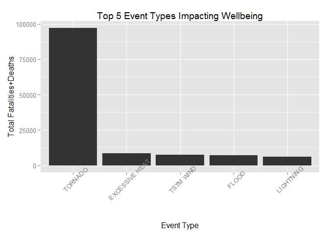

# Readme - Course Project: Reproduceable Results - Assignment 2
Fritz Lowrey  
Wednesday, 20 May 2015  
#What Weather Event Types Have The Greatest Health and Property Impact?

##Synopsis
The analysis performed for this report used data provided by U.S. National Oceanic and Atmospheric Administration's (NOAA) regarding the damage (property and crop) and human impact (fatalities and injuries) of specific weather events. It is the goal of this report to provide general guidance based on national data for emergency planning by answering the following questions from the provided data:

1. Across the United States, which types of events (as indicated in the EVTYPE variable) are most harmful with respect to population health? 

2. Across the United States, which types of events have the greatest economic consequences?

These data include the earliest reported values, in 1950, to the latest available values from 2011. It is worth noting that the analysis addresses aggregate damage and health impact across the nation. This means that these results can not be applied to specific locations without some addition analysis.

##Data Processing
The data will be downloaded, decompressed, and imported from the working directory. Damage and human impact are computed as the sums of the property and crop damage fields; the human impact is the sum of the fatalities and injuries per event type. The data will be loaded, reduced, filtered, and sorted using the DPLYR package; and graphed using the GGPLOT2 package - both freely available from CRON.

###Required Packages
- dplyr
- ggplot2


```r
library(dplyr)
```

```
## Warning: package 'dplyr' was built under R version 3.1.3
```

```
## 
## Attaching package: 'dplyr'
## 
## The following object is masked from 'package:stats':
## 
##     filter
## 
## The following objects are masked from 'package:base':
## 
##     intersect, setdiff, setequal, union
```

```r
library(ggplot2)
```

```
## Warning: package 'ggplot2' was built under R version 3.1.3
```

```r
#Download the file from the source. 
#download.file("https://d396qusza40orc.cloudfront.net/repdata%2Fdata%2FStormData.csv.bz2", destfile="repdata-data-StormData.csv.bz2", mode="wb")

#Uncompress and load the data in to a DPLYR data frame after reducing the field cound and grouping by EVTYPE
filteredData <- tbl_df(read.csv(bzfile("repdata-data-StormData.csv.bz2"))) %>%   
  select(EVTYPE, PROPDMG, PROPDMGEXP, CROPDMG, CROPDMGEXP, FATALITIES, INJURIES) %>%
  filter(PROPDMG > 0 || CROPDMG > 0 || FATALITIES > 0 || INJURIES >0 )  
```

###Massaging the data
The CROPDMGEXP and PROPDMGEXP contain codes the designate whether a unit is in 1s, thousands, millions, or billions. This sets up the multiplier so that we accurately compare data. The codes are defined in supporting documents linked from here:

<https://d396qusza40orc.cloudfront.net/repdata%2Fpeer2_doc%2Fpd01016005curr.pdf>


```r
#Manage the units contained in PROPDMGEXP and CROPDGMEXP
filteredData$CROPDMGEXP <- gsub("K","1000", filteredData$CROPDMGEXP)
filteredData$CROPDMGEXP <- gsub("M","1000000", filteredData$CROPDMGEXP)
filteredData$CROPDMGEXP <- gsub("B","1000000000", filteredData$CROPDMGEXP)
filteredData$CROPDMGEXP <- as.numeric(filteredData$CROPDMGEXP)
```

```
## Warning: NAs introduced by coercion
```

```r
filteredData$CROPDMGEXP[is.na(filteredData$CROPDMGEXP)] = 0

filteredData$PROPDMGEXP <- gsub("K","1000", filteredData$PROPDMGEXP)
filteredData$PROPDMGEXP <- gsub("M","1000000", filteredData$PROPDMGEXP)
filteredData$PROPDMGEXP <- gsub("B","1000000000", filteredData$PROPDMGEXP)
filteredData$PROPDMGEXP <- as.numeric(filteredData$PROPDMGEXP)
```

```
## Warning: NAs introduced by coercion
```

```r
filteredData$PROPDMGEXP[is.na(filteredData$PROPDMGEXP)] = 0
```

Now I'll multiply the damages by the units and reduce the data to just the EVTYPE and computed damage and human impact numbers:


```r
#Roll up the numbers
filteredData <- mutate(filteredData, damageTemp = (CROPDMG*CROPDMGEXP) + (PROPDMG*PROPDMGEXP))
filteredData <- mutate(filteredData, humanTemp = FATALITIES+INJURIES)

#Sum up the values
filteredData <- filteredData %>% group_by(EVTYPE) %>%
  summarize(damage=sum(damageTemp),human=sum(humanTemp))

#reduce the data to just the useful values
filteredData <- select(filteredData, EVTYPE, damage, human) %>% filter(damage >0 & human >0)
```

##Results

###Event Types Causing The Most Damage
It is evident that, in the national aggregate, floods are the most damaging weather event - resulting in property and crop losses of at least $150B since 1950. These results are heavily influenced by season and location, additional results that can be derived by more granular processing of the data.


```r
damageMax <- filteredData %>% select(EVTYPE, damage) %>% arrange(-damage) %>% slice(1:5)

ggplot(damageMax, aes(x=reorder(EVTYPE,-damage), y=damage/1000000000)) + 
  geom_bar(stat = "identity") + 
  ggtitle("Top 5 Damaging Event Types") +
  xlab("Event Type") + ylab("Total Damage Amounts ($ Billions)") + 
  theme(axis.text.x = element_text(angle = 45))
```

 

###Event Types Causing The Greatest Health Impact
The weather event that, in the national aggregate, has the highest impact on human well being (defined as "fatalities + injuries") are tornados. The data for these goes back to 1950 but can't be relied upon before standardization in 1996 - which may also reflect changes in data gathering techniques and building stardards. More granular, date- and location- based analysis may be conducted on the input data if desired.


```r
humanMax <- filteredData %>% select(EVTYPE, human) %>% arrange(-human) %>% slice(1:5)

ggplot(humanMax, aes(x=reorder(EVTYPE,-human), y=human)) + 
  geom_bar(stat = "identity") + 
  ggtitle("Top 5 Event Types Impacting Wellbeing") +
  xlab("Event Type") + ylab("Total Fatalities+Deaths") + 
  theme(axis.text.x = element_text(angle = 45))
```

 

##Addenda
###Data Source(s)
The data is sourced from the following file: <https://d396qusza40orc.cloudfront.net/repdata%2Fdata%2FStormData.csv.bz>. The code in this analysis automatically downloads it for processing, however if you wish to work with it further be prepared with plenty of disc and memory: it's pretty big.


